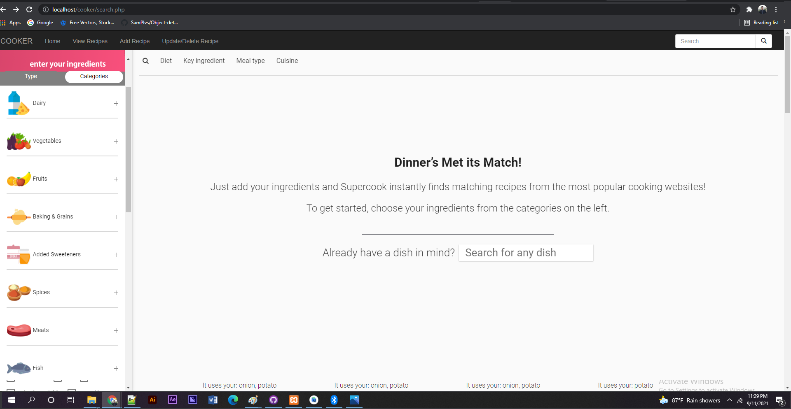
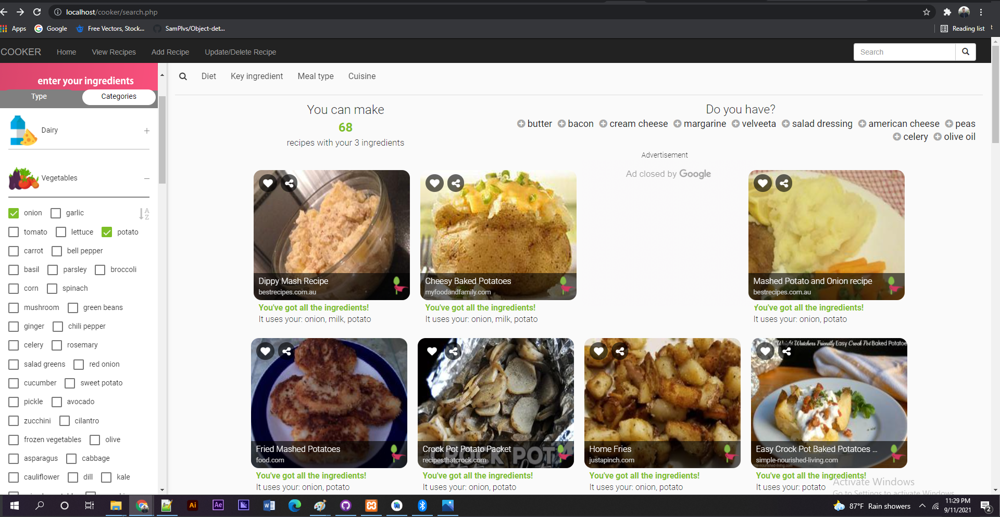

# Cooker
Cooker is basically a recipe webpage but difference is instead of showing just recipe randomly, it also suggests recipes based on user's choice of ingredients. Its the sequel of my andriod app COOKER.
Cooker is built on [PHP][php] and [mySQL][mysql]. 

---

### What is the purpose?
"You give ingredients, COOKER will suggest you recepies." - This is the moto of this cooking page . It's for one of those days, when you open your fridge and all on sudden 
confused yourself, what to make ! COOKER comes handy here. You simply give ingredients, HOLA !! One can also save their personal recipe.

----

### Webpage Interface
<p align="center">
  
  
  <br />
  
   
 	
</p>


----

### Features & User Manual
<!-- AUTO-GENERATED-CONTENT:START (TOC:collapse=true&collapseText="Click to expand") -->
<details>

	* Creaet a recipe
		1. Click "Add Recipe" navigation link.
		2. Fill in the form (minimum title and subtitle).
		3. Click 'Continue' button.
		4. Add the amount, measurement, and name of the ingredient.
		  (Example: 2 tbsp Butter)
		5. Click 'Add Ingredient' button.
		6. After adding last ingredient, click 'Recipe Finished' button.

    * Update a recipe
		1. Click "UPDATE/DELTE Recipe" navigation link.
		2. Choose recipe name in the dropdown.
		3. Follow the directions on the page and click the red link to the right.

    * Delete a Recipe
		1. Click "UPDATE/DELTE Recipe" navigation link.
		2. Choose recipe name in the dropdown.
		3. Click the 'DELETE this Recipe' button.
</details>
<!-- AUTO-GENERATED-CONTENT:END -->

---

### Libraries & Tools Used
[][html]
[][css]
[][php]
[][mysql]
<br /> 

---

### Installation
	* Install local server.
	* Clone Repo to web root.
	* Import my_apron.sql to phpmyadmin
      (Database name: my_apron, Table names: recipe, ingredients)
    * Update inc/connection.php
    * Delete line 2: ```require '/private/database-access.php';```
    * Change Line 5 to your local database connection parameters.
	* View site at index.php.

[html]: https://raw.githubusercontent.com/github/explore/80688e429a7d4ef2fca1e82350fe8e3517d3494d/topics/html/html.png
[css]: https://raw.githubusercontent.com/github/explore/80688e429a7d4ef2fca1e82350fe8e3517d3494d/topics/css/css.png
[php]: https://github.com/sabbirahmedAUST/Cooker_Webpage/tree/main/img/php.png
[mysql]: https://github.com/sabbirahmedAUST/Cooker_Webpage/tree/main/img/mysql.png
